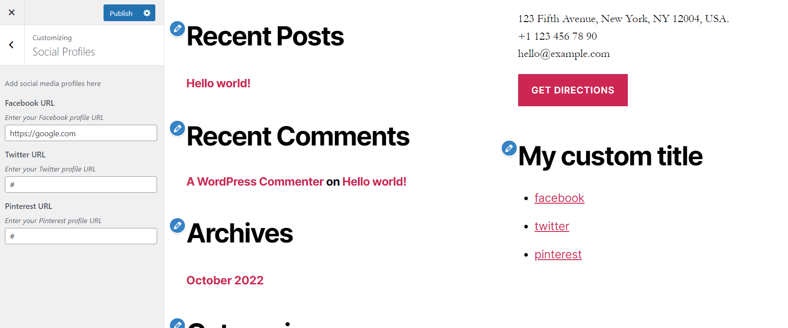

# Extensible Social Profile Wordpress Plugin

Add links to your social networks using the power of wordpress widgets

## How to use it

From the theme Customize find Social Profile options.

If you want to install this plugin in your wordpress site, make sure to use just the extensible-social-profile folder. The mu-plugins folder is just an example of variations.

## Need to add or remove a social profile?

If you need to add or remove a new profile, you can do it from the mu-plugins folder. 

I have added an example of how to add, remove and extend the plugin.

## Overview

